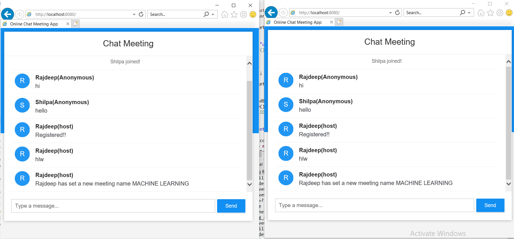

## Requirements

1. Java - 1.8.x

2. Maven - 3.x.x

## Steps to Setup


**1. Clone the application**

```bash
git clone https://github.com/rajdeeppal/spring-boot-chat-application-java.git```

**2. Build and run the app using maven**

```bash
cd spring-boot-websocket-chat-demo
mvn package
java -jar target/websocket-demo-0.0.1-SNAPSHOT.jar
```

**3. Alternatively, you can run the app directly without packaging it like so - **

```bash
mvn spring-boot:run```
##Features added
**You can perform many automated feature like mail service using simple commands**
1. Automatically assign ‘Host’ to that register person who started the session first, and assign ‘Anonymous’  to that person who is not a register user, in order to register yourself you need to enter your email id in the chat box any time.

2. User can switch host, in-order to give all access
COMMAND: change host @user name [Note: user must be a register user and online too]

3. Host can set the meeting name or topic, by default the meeting name is ‘public’.
COMMAND: set meeting name #meeting name

4. Host can change the meeting name if required
COMMAND: change meeting name #meeting name

5. Host can able to give same or different assignment to all participants or some number of participants by a single command
COMMAND: Assignment assignment_number @Assignee #content $Deadline [Note: if you want to give same assignment to all participants then give a blank space in the ‘Assignee’ place , if you want to give same assignment to some number of participants then mention their name separated by comma ]

6. Host can send those assignment to the respective people via email automatically mentioning the assignment and the deadline in the email
COMMAND: send assignment

7. Host can check the pending assignments that is send to participants but not yet submitted
COMMAND: pending assignment

8. Register user can change their assignment submission status into ‘submitted’, after actually submit the respective assignment assign to them
COMMAND: submitted assignment_number

9. When the host starts the meeting automatically a joining link will send to all the register participants containing the host name

10. when the host starts the meeting or session a remainder email will send to the all participants if he or she having their assignment pending
